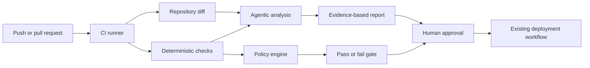

# Sentinel

Agentic CI/CD release guardian that analyzes changes, tests, security checks,
and deployments to explain failures, assess release risk, and recommend safe
actions.

Sentinel is currently in design and bootstrap. The first release will establish
deterministic checks and policy evaluation before adding an LLM analysis layer.

## Development

```sh
python -m pip install --editable .
python -m unittest discover --start-directory tests --verbose
sentinel --version
```

## Principles

- Deterministic checks own pass/fail decisions.
- The agent explains evidence; it does not invent test outcomes.
- Findings cite files, lines, checks, and logs.
- Production changes require explicit human approval.
- Repository access is read-only by default.
- Secrets, arbitrary shell access, and autonomous deployment are out of scope.

## Planned Commands

```text
sentinel assess      Assess release risk from a Git diff and check results
sentinel regression  Select and run change-aware regression suites
sentinel security    Run configured security checks
```

## Architecture



The deterministic gate remains authoritative. Agent output can raise risk,
explain failures, and request review, but cannot convert a failed check into a
pass.

## Backend Lab

Sentinel will be developed as an independent repository and integrated into the
Backend Lab GitHub Actions pipeline after its deterministic foundation is
stable. It is a CI tool, not a runtime Docker Compose service.

Architecture, configuration, and the roadmap live in the sibling Lab
repository under `content/docs/`. The project-specific policy is
`lab/sentinel.yml`.
